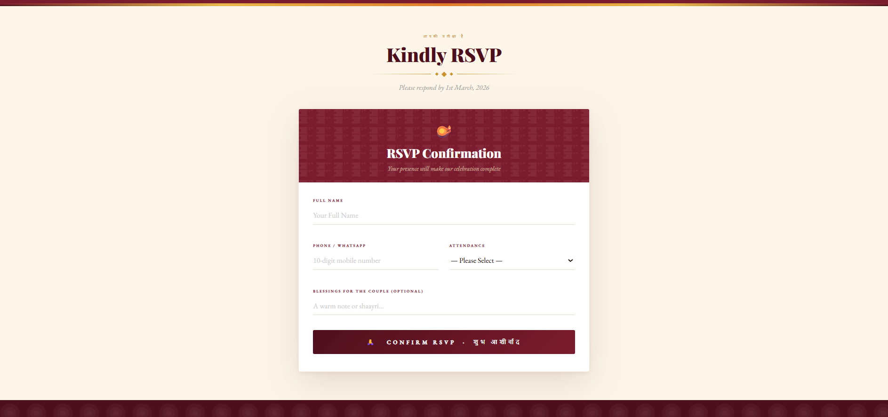
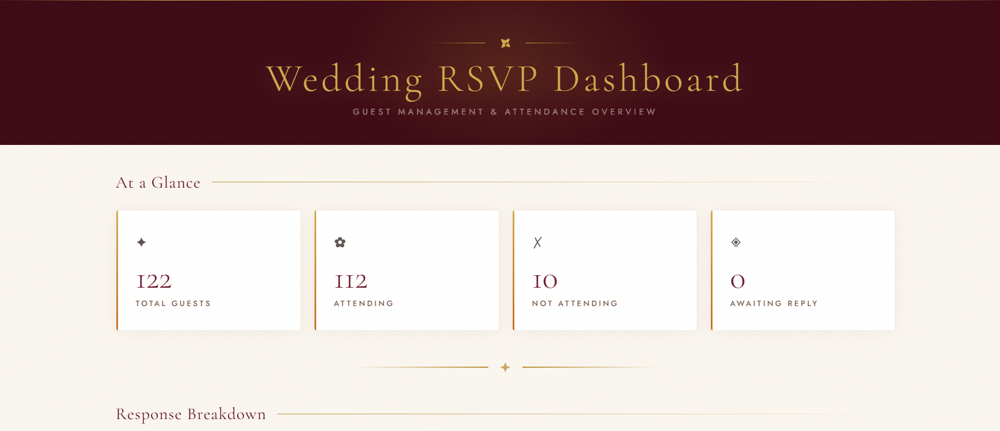
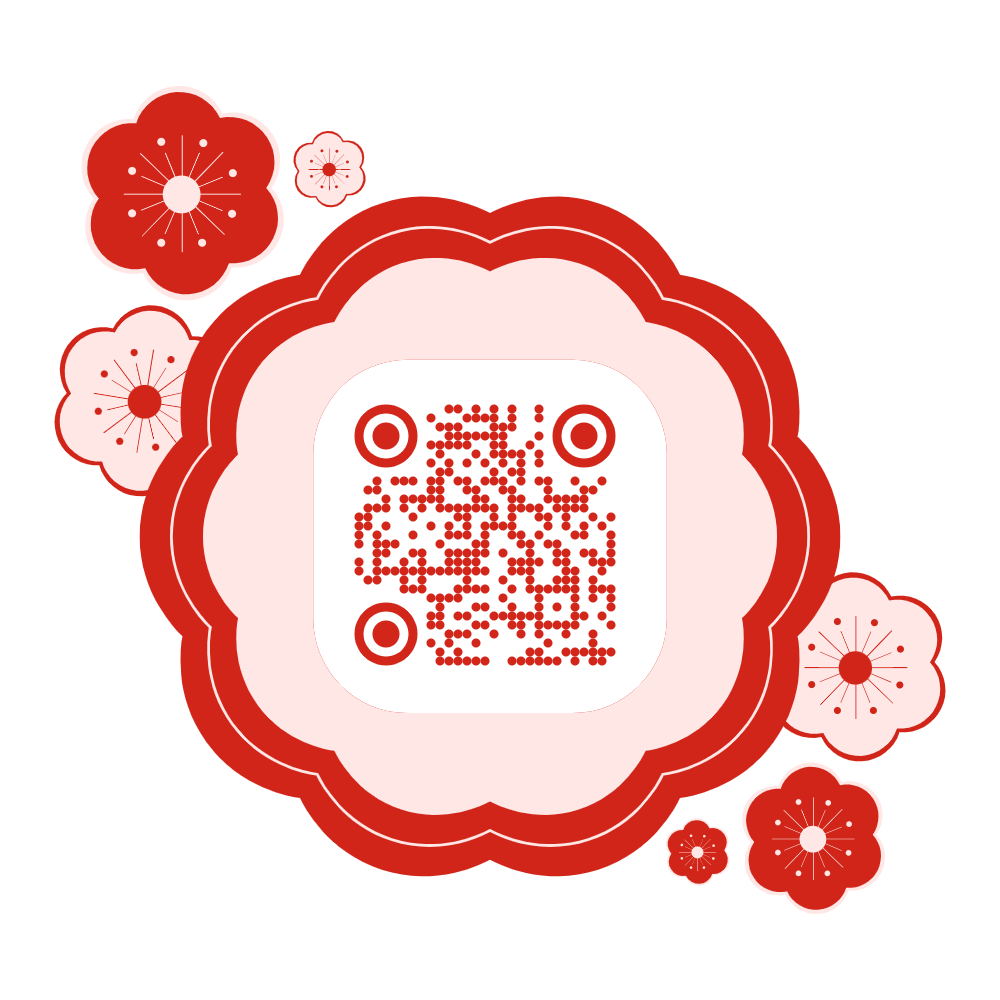

# 💍 WedTech – Wedding RSVP & Event Management Platform


---

## 🌐 Live Demo
**[👉 View Live Website](https://weddinginvite-3f30f.web.app/)**

---

## 📌 Project Overview

**WedTech** is a full-stack Wedding RSVP and Event Management Platform developed as part of the **WedTech Innovation Challenge at Xpecto '26**, the annual technical fest organized by **IIT Mandi**.

The platform simplifies digital wedding guest management by providing a complete solution for sending invitations, collecting RSVPs, and coordinating event details — all in one place.

Built and deployed by a team of 4 within a competitive hackathon environment.

---

## ✨ Features

| Feature | Description |
|---|---|
| 💌 Digital Invitations | Beautiful digital event invitation platform |
| ✅ RSVP Registration | Guest response collection and management system |
| 🔥 Firebase Integration | Real-time database for storing participant data |
| 📊 Interactive Dashboard | Graphical insights and response tracking |
| 🗺️ Location Integration | Map integration for event navigation |
| 👗 Event Details | Dress code, inspiration, and event information sections |
| 📱 QR Code Access | QR code-based access for easy website sharing |
| 📱 Responsive Design | Works seamlessly on mobile and desktop |

---

## 🛠️ Tech Stack

- **Frontend:** HTML5, CSS3, JavaScript
- **Database:** Firebase Realtime Database
- **Hosting:** Firebase Hosting + Netlify
- **Tools:** Firebase CLI, Netlify CLI

---

## 📂 Project Structure

```
wedding-rsvp-platform/
│
├── index.html              # Main homepage & invitation page
├── dashboard.html          # RSVP dashboard with graphs
├── 404.html                # Custom error page
├── firebase.json           # Firebase hosting configuration
├── .firebaserc             # Firebase project settings
├── netlify.toml            # Netlify deployment configuration
├── Wedding.png             # QR code for website access
├── .gitignore              # Git ignore file
│
├── screenshots/            # Website screenshots
│   ├── homepage.png
│   └── dashboard.png
│
└── README.md
```

---

## 🚀 Getting Started

### View the live website
👉 **[https://weddinginvite-3f30f.web.app/](https://weddinginvite-3f30f.web.app/)**

### Run locally
1. Clone the repository
```bash
git clone https://github.com/ashiiihereee/wedding-rsvp-platform.git
cd wedding-rsvp-platform
```

2. Open `index.html` in your browser directly
```bash
# Or use Live Server in VS Code
```

3. For Firebase features, set up your own Firebase project and update the config in `index.html`

---

## 📸 Screenshots

### Homepage


### Dashboard


---

## 📱 QR Code Access

Scan the QR code below to instantly access the platform:



---

## 🔑 Key Learnings

- Full-stack web development from idea to deployment
- Firebase Realtime Database integration
- Responsive UI/UX design
- QR code implementation
- Hackathon problem-solving under time constraints
- Team collaboration and version control

---

## 👥 Team

| Name | Role |
|---|---|
| Ashna Bansal | Frontend Development & Firebase Integration |
| Avneet Kaur | UI/UX Design & Frontend |
| Devanshi Sharma | Frontend Development |
| Jayesh Mohan | Database & Deployment |

---

## 🏆 About the Hackathon

- **Event:** Xpecto '26 — Annual Technical Fest, IIT Mandi
- **Challenge:** WedTech Innovation Challenge
- **Problem Statement:** Build a digital Wedding RSVP and Event Management Platform
- **Team Size:** 4 members
- **Duration:** Hackathon timeframe

---

## 🙏 Acknowledgements

- **IIT Mandi** — for organizing Xpecto '26 and the WedTech Challenge
- [Firebase](https://firebase.google.com/) — for real-time database and hosting
- [Netlify](https://netlify.com/) — for deployment support
